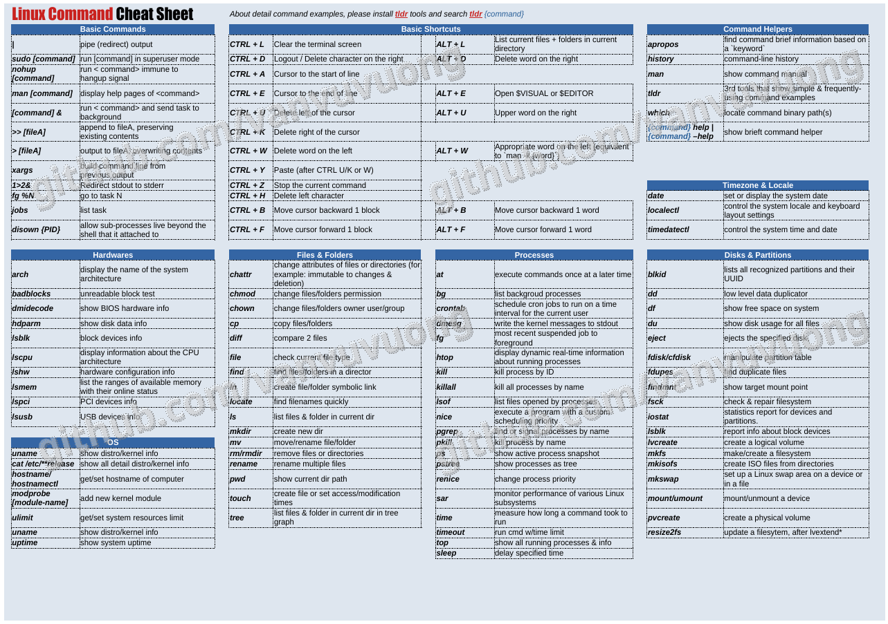

# Chapter 1: Linux Command-line & Shell scripting

## 1.1 Bash/Shell

### Special variables

| Symbol    | Meaning                                                         |
| --------- | --------------------------------------------------------------- |
| $0        | The name of the Bash script.                                    |
| $1-$9     | The first 9 arguments to the Bash script. (As mentioned above.) |
| $#        | How many arguments were passed to the Bash script.              |
| $@        | All the arguments supplied to the Bash script.                  |
| $?        | The exit status of the most recently run process.               |
| $$        | The process ID of the current script.                           |
| $USER     | The username of the user running the script.                    |
| $HOSTNAME | The hostname of the machine the script is running on.           |
| $SECONDS  | The number of seconds since the script was started.             |
| $RANDOM   | Returns a different random number each time is it referred to.  |
| $LINENO   | Returns the current line number in the Bash script.             |

### Bash keywords

| -    | -    | -      | -      | -        | -    |
| ---- | ---- | ------ | ------ | -------- | ---- |
| if   | then | elif   | else   | fi       | time |
| for  | in   | until  | while  | do       | done |
| case | esac | coproc | select | function |
| {    | }    | [[     | ]]     | !        |

### Expression

- How to evaluate an expression:

  - `test` expression
  - [[expression]]

- Operator:

  - &&: run next command if the previous is successful

Example:

```shell
test -d "$directory" && cd "$directory"
```

- ||: run next command if the previous is failed

Example:

```shell
cd "$directory" && echo "Success" || echo "Failed"
```

### Control stdout in Linux

|            | visible in terminal |            | visible in file |            |  existing |
| ---------- | ------------------: | :--------- | --------------: | :--------- | --------: |
| **Syntax** |          **StdOut** | **StdErr** |      **StdOut** | **StdErr** |  **file** |
| >          |                  no | yes        |             yes | no         | overwrite |
| >>         |                  no | yes        |             yes | no         |    append |
| 2>         |                 yes | no         |              no | yes        | overwrite |
| 2>>        |                 yes | no         |              no | yes        |    append |
| &>         |                  no | no         |             yes | yes        | overwrite |
| &>>        |                  no | no         |             yes | yes        |    append |
| tee        |                 yes | yes        |             yes | no         | overwrite |
| tee -a     |                 yes | yes        |             yes | no         |    append |
| n.e. (\*)  |                 yes | yes        |              no | yes        | overwrite |
| n.e. (\*)  |                 yes | yes        |              no | yes        |    append |
| & tee      |                 yes | yes        |             yes | yes        | overwrite |
| & tee -a   |                 yes | yes        |             yes | yes        |    append |

List:

- `command > output.txt`

The standard output stream will be redirected to the file only, it will not be visible in the terminal. If the file already exists, it gets overwritten.

- `command >> output.txt`

The standard output stream will be redirected to the file only, it will not be visible in the terminal. If the file already exists, the new data will get appended to the end of the file.

---

- `command 2> output.txt`

The standard error stream will be redirected to the file only, it will not be visible in the terminal. If the file already exists, it gets overwritten.

- `command 2>> output.txt`

The standard error stream will be redirected to the file only, it will not be visible in the terminal. If the file already exists, the new data will get appended to the end of the file.

---

- `command &> output.txt`

Both the standard output and standard error stream will be redirected to the file only, nothing will be visible in the terminal. If the file already exists, it gets overwritten.

- `command &>> output.txt`

Both the standard output and standard error stream will be redirected to the file only, nothing will be visible in the terminal. If the file already exists, the new data will get appended to the end of the file..

---

- `command | tee output.txt`

The standard output stream will be copied to the file, it will still be visible in the terminal. If the file already exists, it gets overwritten.

- `command | tee -a output.txt`

The standard output stream will be copied to the file, it will still be visible in the terminal. If the file already exists, the new data will get appended to the end of the file.

---

- `(*)`

Bash has no shorthand syntax that allows piping only StdErr to a second command, which would be needed here in combination with tee again to complete the table. If you really need something like that, please look at "How to pipe stderr, and not stdout?" on Stack Overflow for some ways how this can be done e.g. by swapping streams or using process substitution.

---

- `command |& tee output.txt`

Both the standard output and standard error streams will be copied to the file while still being visible in the terminal. If the file already exists, it gets overwritten.

- `command |& tee -a output.txt`

Both the standard output and standard error streams will be copied to the file while still being visible in the terminal. If the file already exists, the new data will get appended to the end of the file.

[**Original Post**](https://askubuntu.com/questions/420981/how-do-i-save-terminal-output-to-a-file)

### STD in/out conventionals

- `> /dev/null` throw away _stdout_
- `1> /dev/null` throw away _stdout_
- `2> /dev/null` throw away _stderr_
- `&> /dev/null` throw away _stdout_ and _stderr_

### Need to know command lines list:

I have created a Linux CLI cheatsheet, example you could see below:



Checkout [here](https://github.com/vanvuvuong/vanvuvuong/blob/master/files/Linux%20Commands.pdf) for the PDF file.

### Bash exit status

| Exit Status Code                 | Description                           |
| -------------------------------- | ------------------------------------- |
| 0                                | success                               |
| 1                                | failure, as defined by the program    |
| 2                                | command line usage error              |
| different value than those above | custom exit code for specific program |

Source: [Exit & Error Codes in bash and Linux OS](https://www.adminschoice.com/exit-error-codes-in-bash-and-linux-os)

### Bash error code meaning

| Exit Code Number | Meaning                        | Examples                                                      | Comments                                                                                                    |
| ---------------- | ------------------------------ | ------------------------------------------------------------- | ----------------------------------------------------------------------------------------------------------- |
| 1                | Catchall for general errors    | let "var1 = 1/0"                                              | Miscellaneous errors, such as "divide by zero" and other impermissible operations                           |
| 2                | Misuse of shell builtins       |                                                               | Missing keyword or command, or permission problem (and diff return code on a failed binary file comparison) |
| _124_            | You need to be root            |                                                               | System script started as a non-root user                                                                    |
| _125_            | Unconfigured                   |                                                               | Missing configuration file or value                                                                         |
| 126              | Command invoked cannot execute |                                                               | Permission problem or command is not an executable                                                          |
| 127              | "command not found"            |                                                               | Possible problem with `$PATH` or a typo                                                                     |
| 128              | Invalid argument to exit       | exit 3.14159                                                  | exit takes only integer args in the range 0 - 255                                                           |
| 128+n            | Fatal error signal "n"         | kill -9 $PPIDof script                                        | `$?` returns 137 (128 + 9)                                                                                  |
| 130              | Script terminated by Control-C | Control-C is fatal error signal 2, (130 = 128 + 2, see above) |
| 255              | Exit status out of range       | exit -1                                                       | exit takes only integer args in the range 0 - 255                                                           |

Github source: [debian-server-tools](https://github.com/szepeviktor/debian-server-tools/blob/master/Bash-exit-codes.md)

Source: [Advanced Bash-Scripting Guide Appendix E.](https://www.tldp.org/LDP/abs/html/exitcodes.html) & [Appendix C. Exit Codes With Special Meanings](https://www.linuxdoc.org/LDP/abs/html/exitcodes.html)

Custom Exit Code Numbers are marked in _italic_.

### Condition

- IF#condition

```shell
if [ -d "$directory" ] && cd "$directory"; then
    echo "Run command"
fi
```

- IF-ELIF

```shell
if [ -z $0 ]; then
    echo "Run command 1"
elif [ -n $0 ]; then
    echo "Run command 2"
fi
```

- IF-ELIF-ELSE

```shell
if [ -z $0 ]; then
    echo "Run command 1"
elif [ -n $0 ]; then
    echo "Run command 2"
else
    echo "Run command 3"
fi
```

- CASE

```shell
case $# in
3) ;; ## We need 3 args, so do nothing
*)
    printf "%s\n" "Please provide three names" >&2
    exit 1
    ;;
esac
```

- IF statement

| Operator                   | Description                                                           |
| -------------------------- | --------------------------------------------------------------------- |
| ! EXPRESSION               | The EXPRESSION is false.                                              |
| condition 1 -a condition 2 | CONDITION 1 and CONDITION 2.                                          |
| condition 1 -o condition 2 | CONDITION 1 or CONDITION 2.                                           |
| -n STRING                  | The length of STRING is greater than zero.                            |
| -z STRING                  | lengh of STRING is zero (ie it is empty).                             |
| STRING1 =/!= STRING2       | STRING1 is equal/not-equal to STRING2                                 |
| INTEGER1 -eq/ne INTEGER2   | INTEGER1 is numerically equal/not-equal to INTEGER2                   |
| INTEGER1 -gt/lt INTEGER2   | INTEGER1 is numerically greater than or less than INTEGER2            |
| INTEGER1 -ge/le INTEGER2   | INTEGER1 is numerically greater-than/less-than or equal to INTEGER2   |
| -b/c FILE                  | FILE is a block/character device.                                     |
| -d/f/p/S FILE              | FILE exists and is a directory/regular-file/pipe/socket.              |
| -e FILE                    | FILE exists.                                                          |
| -h/L FILE                  | FILE is a symbolic link.                                              |
| -s FILE                    | FILE exists and it's SIZE is greater than ZERO (ie. it is not empty). |
| -r/w/x FILE                | FILE exists and read/write/execute permission is granted.             |
| f1 -nt/ot/ef f2            | FILE 1 is newer-than/older-than/has-hard-link-to-same-file            |

Source: [Bash Script Tutorial - 5. If Statements](https://ryanstutorials.net/bash-scripting-tutorial/bash-if-statements.php) & [File test operators](https://tldp.org/LDP/abs/html/fto.html)

### Loop

Read a file line by line assigning the value to a variable:

```shell
while read -r line; do
    echo "Text read from file: $line"
done < my_filename.txt
```

Loop string in array:

```shell
array=("string1" "string2")
for string in ${array[@]}; do
    echo $string
done
```

> with array index

```shell
allThreads=("string1" "string2")
for i in ${!allThreads[@]}; do
  echo ${allThreads[$i]}
done
```

### Handy snippets

- Read a file line by line assigning the value to a variable

```shell
while read -r line; do
    echo "Text read from file: $line"
done < my_filename.txt
```

---

- Simple multiple files/folders maker

```shell
mkdir -p project/{app,frontend,backend}
touch {main,variables,provider}.tf
```

---

- Loop in a string array

```shell
b=("aa" "ab"); for t in ${b[@]} ; do echo $t ; done
echo ${#b[@]} # get array length
```

---

- Run multiple replicated command with multiple files

```shell
for a in *.yml; ansible-playbook "$a" --syntax-check ; done
```

---

- Do multiple silent task

```shell
for file in $(find /home/ec2-user/ -type f); do cmd1 $file | cmd2 &disown ; done
```

```shell
command > file.log 2>&1 &
```

---

- Backgroud process to file (stdout + stderr)

```shell
command > file.log 2>&1 &
```

Explanation:

- `>` stdout to file
- `2>&1`: redirect stderr to stdout
- `&`: run process in backgroud

---

- Update multiple files' name in 1 command

```shell
find . -name "*_f"| sed "s/.\///g" | while read f ; do mv "$f" "${f%?????}_f"; done
```

- Manage IP tables

```shell
iptables -P INPUT ACCEPT
iptables -I INPUT 1 -p tcp -s 159.89.202.45 -j ACCEPT
iptables -P FORWARD ACCEPT
iptables -P OUTPUT ACCEPT
iptables -P INPUT DROP
```

---

- `telnet`

- Without interaction

```shell
echo -e '\x1dclose\x0d' | telnet {$IP_ADDRESS} {$PORT}
```

- Multiple IPs with SSH port

```shell
PORT=22 list=("172.29.211.1" "172.29.211.2") ; for ip in "${list[@]}" ; do echo -e '\x1dclose\x0d' | timeout 2 telnet $ip {$PORT} && echo "connect $ip success" || echo "connect $ip failed" ; done
```

---

- `sed` common use cases

- Replace string directly on file

```shell
sed -i 's/pattern1/pattern2/g' filename
```

---

- Concatenate file common use cases

- Insert multiple-lines text in to new file

```shell
cat <<EOF > filename
Multiple
Lines
Text
Data
EOF
```

- Appending multiple-lines text in to existed file

```shell
cat <<EOF >> filename
Multiple
Lines
Text
Data
EOF
```

- Append text with sudoers (persistent mount point)

```shell
echo -e "\nnfs-uuid:/  /mnt/efs nfs4 nfsvers=4.1,rsize=1048576,wsize=1048576,hard,timeo=600,retrans=2,noresvport,_netdev 0 0" | sudo tee -a /etc/fstab
```

- Append content to file with sudo privileges

- Create multiple-lines text file as sudoer

```shell
sudo tee /etc/systemd/system/custom-service.service > /dev/null <<-EOF
# *****************************************************************
# *********************** Custom Service **************************
# *****************************************************************

[Unit]
Description=Custom Service
After=network.target

[Service]
ExecStart=/start/script/for/custom-service
ExecStop=/stop/script/for/custom-service
User=root

[Install]
WantedBy=multi-user.target
EOF
```

- Create json file with variable in bash

```shell
SAMPLE='
{
    "Comment": "Update DNSName.",
    "Changes": [
        {
            "Action": "UPSERT",
            "ResourceRecordSet": {
                "Name": "alex.",
                "Type": "A",
                "AliasTarget": {
                    "HostedZoneId": "-##",
                    "DNSName": "$bar",
                    "EvaluateTargetHealth": false
                }
            }
        }
    ]
}
'
echo "${SAMPLE}" | tee output-file-path.json > /dev/null
```

- Trim 2 last string

```shell
new_string=${string%??}
```

- Convert string to array

```shell
IFS=" " read -a array <<< "1 2 3 4"
```

```shell
array=($(echo "one,two,three" | tr ',' '\n'))
```

## 1.2 Fish/Shell

### Fish keywords

| -       | -        | -      | -       | -     |
| ------- | -------- | ------ | ------- | ----- |
| and     | begin    | break  | builtin | case  |
| command | continue | else   | end     | exec  |
| for     | function | if     | in      | not   |
| or      | return   | switch | time    | while |

### Fish builtins

| -           | -         | -      | -      | -           |
| ----------- | --------- | ------ | ------ | ----------- |
| abbr        | argparse  | bind   | cd     | commandline |
| complete    | contains  | count  | echo   | eval        |
| fish_config | math      | printf | random | read        |
| set         | set_color | source | status | string      |
| test        | type      |        |        |             |

## 1.3 Linux Basic Commands

### Users & Groups

```shell
chage
chgrp
chown
chfn
id
passwd
su
useradd
userdel
usermod
who
whoami
```

### Files & Folders

```shell
chattr
chmod
file
find
ln
locate
ls
lsof
mkdir
mv
pwd
rm
rmdir
rename
tar
touch
tree
zip/unzip/gzip
```

### Stdin/stdout

```shell
awk
cat
cut
diff
grep
head
jq
less
more
nano
sed
sort
tail
tee
uniq
vi
vim
watch
wc
```

### Disks & Partitions

```shell
blkid
dd
df
du
duc
fdisk
mkisofs
mkswap
mount
```

### Networking

```shell
arp
curl
dig
dnf
ftp
hostname
hostnamectl
ifconfig
iostat
ip
iptables
lftp
lpadmin
lpstat
nc
netstat
nmap
nmtui
nslookup
ping
rsync
scp
sftp
ss
ssh
telnet
traceroute
wget
```

### Processes & Services

```shell
at
crontab
dmesg
free
htop
kill
lsof
nice
pgrep
pkill
ps
pstree
renice
sar
service
systemctl
top
vmstat
w
```

### Command helper

```shell
apropos
cheat
history
info
man
tldr
```

### Package manager

```shell
apk
apt
apt-get
dnf
pacman
rpm
yum
zypper
```

### Hardware related

```shell
arch
dmidecode
lsblk
lscpu
lsmem
lspci
lsusb
```

### Hash

```shell
cksum
md5sum
sha1sum
sha224sum
sha256sum
sha384sum
sha512sum
shasum
```

### Encryption

```shell
gpg
gpgv
ssh-keygen
```

### Others

```shell
alias
date
figlet
last
lastb
make
poweroff
reboot
screen
shutdown
timedatectl
unalias
uptime
```
