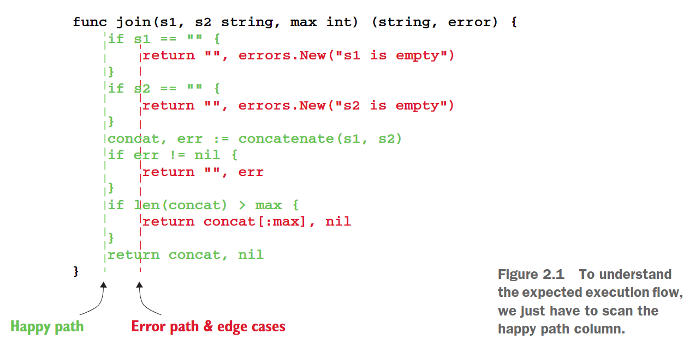
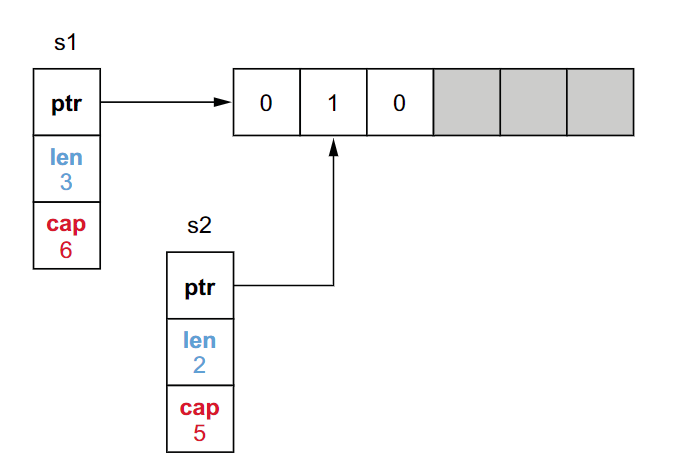
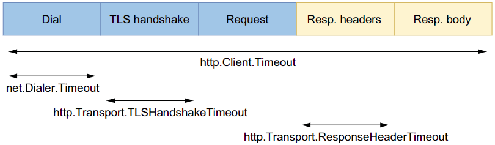

# Table of content <sup><sup>[back](../README.md)</sup></sup>

- [Table of content back](#table-of-content-back)
- [Code \& project organize](#code--project-organize)
- [Data Type](#data-type)
- [Control Structures](#control-structures)
- [Errors Management](#errors-management)
- [Standard Library](#standard-library)

# [Code & project organize](#table-of-content-back)

<details>
<summary> Unintended variable shadowing </summary>

> Inner variable override value of outer variable

- ~~Instead of~~

  ```go
  var client *http.Client
  if tracing {
      client, err := createClientWithTracing()
      if err != nil {
        return err
    }
    log.Println(client)
  } else {
    client, err := createDefaultClient()
    if err != nil {
    return err
    }
    log.Println(client)
  }
  // Use client
  ```

- Use this

  ```go
  var client *http.Client
  var err error
  if tracing {
      client, err = createClientWithTracing()
      if err != nil {
        return err
    }
  } else {
  // Same logic
  }
  // Use client
  ```

- Or this
  ```go
  var client *http.Client
  var err error
  if tracing {
    client, err = createClientWithTracing()
  } else {
    client, err = createDefaultClient()
  }
  if err != nil {
  // Common error handling
  }
  ```
  </details>

---

<details>
<summary> Unnecessary nested code </summary>

> Hard readable codes are difficult to understand & maintain.

- ~~Instead of~~
  ```go
    // This join function concatenates two strings and returns a substring if the length is greater than max
    func join(s1, s2 string, max int) (string, error) {
      if s1 == "" {
        return "", errors.New("s1 is empty")
      } else {
        if s2 == "" {
          return "", errors.New("s2 is empty")
          } else {
            concat, err := concatenate(s1, s2)
            if err != nil {
              return "", err
            } else {
              if len(concat) > max {
                return concat[:max], nil
            } else {
                return concat, nil
            }
          }
        }
      }
    }
  ```
- [Use this](https://medium.com/@matryer/line-of-sight-in-code-186dd7cdea88)
  > Align the happy path to the left; you should quickly be able to scan down one column to see the expected execution flow.
  ```go
  func join(s1, s2 string, max int) (string, error) {
    if s1 == "" {
      return "", errors.New("s1 is empty")
    }
    if s2 == "" {
      return "", errors.New("s2 is empty")
    }
    concat, err := concatenate(s1, s2)
    if err != nil {
      return "", err
    }
    if len(concat) > max {
      return concat[:max], nil
    }
    return concat, nil
  }
  ```
  
    </details>

---

<details>
<summary> Create utility packages </summary>

> util is meaningless, instead of that, write meaningful packages & methods

- ~~Instead of~~
  ```go
  package util
  func NewStringSet(...string) map[string]struct{} {
    // ...
  }
  func SortStringSet(map[string]struct{}) []string {
    // ...
  }
  set := util.NewStringSet("c", "a", "b")
  fmt.Println(util.SortStringSet(set))
  ```
- Use this
  ```go
  package stringset
  func New(...string) map[string]struct{} { ... }
  func Sort(map[string]struct{}) []string { ... }
  ```
  </details>

---

# [Data Type](#table-of-content-back)

<details>
<summary> Slice length & capacity </summary>

```go
s1 := make([]int, 3, 6) // 3-length, 6 capacity slice
```



</details>

---

<details>
<summary> Inefficient slice initialization </summary>

> Without define slice capacity, `append` function will create new slice every time the old array capacity were full.

- ~~Instead of~~
  ```go
  func convert(foos []Foo) []Bar {
    bars := make([]Bar, 0)
    for _, foo := range foos {
      bars = append(bars, fooToBar(foo))
    }
    return bars
  }
  ```
- Use this
  ```go
  func convert(foos []Foo) []Bar {
    n := len(foos)
    bars := make([]Bar, 0, n)
    for _, foo := range foos {
      bars = append(bars, fooToBar(foo))
    }
    return bars
  }
  ```
- Or this
  ```go
  func convert(foos []Foo) []Bar {
    n := len(foos)
    bars := make([]Bar, n)
    for i, foo := range foos {
      bars[i] = fooToBar(foo)
    }
    return bars
  }
  ```
  </details>

---

<details>
<summary> Not making slice copies correctly </summary>

> The `copy` function will copy source slice to destination slice (with the length is the minimum length of these 2 slice)

- ~~Instead of~~
  ```go
  src := []int{0, 1, 2}
  var dst []int
  copy(dst, src)
  fmt.Println(dst)
  ```
- Use this
  ```go
  src := []int{0, 1, 2}
  dst := make([]int, len(src))
  copy(dst, src)
  fmt.Println(dst)
  ```
  </details>

---

<details>
<summary> Unexpected side effects using slice append </summary>

> `append` will override value of original slice

- ~~Instead of~~
  ```go
  s1 := []int{1, 2, 3}
  s2 := s1[0:2]
  s3 := append(s2, 10) // this will replace 10 vs 3 in s1
  ```
- Use this
  ```go
  s1 := []int{1, 2, 3}
  s2 := make([]int, 2)
  copy(s2, s1)
  s3 := append(s3, 10)
  ```
- Or this
  ```go
  s1 := []int{1, 2, 3}
  s2 := s1[0:2:2]
  s3 := append(s2, 10) // this will replace 10 vs 3 in s1
  ```
  </details>

---

<details>
<summary> Slices & memory leaks </summary>

> Just access those 5 bytes of million bytes message using `slicing operation` will lead to memory leak by keep whole message slice in RAM

- ~~Instead of~~
  ```go
  func consumeMessages() {
    for {
      msg := receiveMessage()
      // Do something with msg
      storeMessageType(getMessageType(msg))
    }
  }
  func getMessageType(msg []byte) []byte {
    return msg[:5]
  }
  ```
- Use this
  ```go
  func getMessageType(msg []byte) []byte {
    msgType := make([]byte, 5)
    copy(msgType, msg)
    return msgType
  }
  ```
  </details>

---

<details>
<summary> Inefficient map initialization </summary>

> Same idea with create `slice` with predefine `capacity`. To reduce the compute resource when `map` size increase overtime

- ~~Instead of~~
  ```go
  m := map[string]int{
  "1": 1,
  "2": 2,
  "3": 3,
  }
  ```
- Use this
  ```go
  m := make(map[string]int, 1_000_000)
  m["1"] = 1
  m["2"] = 2
  m["3"] = 3
  ```
  </details>

---

<details>
<summary> Comparing value incorrectly </summary>

> `slice & map` doesn't compile.
> comparable with `==` & `!=`: bool, numberics, string, channel, interface, pointer, struct & array
> `reflect` compare may work, but trade off is performance compare to custom code to compare each element inside them

- ~~Instead of~~
  ```go
  cust1 := customer{id: "x", operations: []float64{1.}}
  cust2 := customer{id: "x", operations: []float64{1.}}
  fmt.Println(reflect.DeepEqual(cust1, cust2))
  ```
- Use this
  ```go
  func (a customer) equal(b customer) bool {
    if a.id != b.id {
      return false
    }
    if len(a.operations) != len(b.operations) {
      return false
    }
    for i := 0; i < len(a.operations); i++ {
      if a.operations[i] != b.operations[i] {
        return false
      }
    }
    return true
  }
  ```
  </details>

---

# [Control Structures](#table-of-content-back)

<details>
<summary> Ignore that elements are copied in range loops </summary>

- ~~Instead of~~
  ```go
  accounts := []account{
    {balance: 100.},
    {balance: 200.},
    {balance: 300.},
  }
  for _, a := range accounts {
    a.balance += 1000
  }
  // a will be [{100} {200} {300}] after range loop
  ```
- Use this
  ```go
  for i := range accounts {
    accounts[i].balance += 1000
  }
  for i := 0; i < len(accounts); i++ {
    accounts[i].balance += 1000
  }
  ```
  </details>

---

<details>
<summary> Ignore how break statement work </summary>

> Unexpected result when misunderstanding `break` statement

- ~~Instead of~~
  ```go
  // this will terminate the switch block, not for block
  for i := 0; i < 5; i++ {
    fmt.Printf("%d ", i)
    switch i {
      default:
    case 2:
      break
    }
  }
  ```
- Use this
  ```go
  // terminate for block
  loop:
    for i := 0; i < 5; i++ {
      fmt.Printf("%d ", i)
      switch i {
        default:
        case 2:
          break loop
      }
    }
  ```
  </details>

---

# [Errors Management](#table-of-content-back)

<details>
<summary> Handle errors twice </summary>

> Duplicated code when handling error. Either use `log` or `return`, never both.

- ~~Instead of~~

  ```go
  func GetRoute(srcLat, srcLng, dstLat, dstLng float32) (Route, error) {
    err := validateCoordinates(srcLat, srcLng)
    if err != nil {
      log.Println("failed to validate source coordinates")
      return Route{}, err
    }
    err = validateCoordinates(dstLat, dstLng)
    if err != nil {
      log.Println("failed to validate target coordinates")
      return Route{}, err
    }
    return getRoute(srcLat, srcLng, dstLat, dstLng)
  }

  func validateCoordinates(lat, lng float32) error {
    if lat > 90.0 || lat < -90.0 {
      log.Printf("invalid latitude: %f", lat)
      return fmt.Errorf("invalid latitude: %f", lat)
    }
    if lng > 180.0 || lng < -180.0 {
      log.Printf("invalid longitude: %f", lng)
      return fmt.Errorf("invalid longitude: %f", lng)
    }
    return nil
  }
  ```

- Use this

  ```go
  func GetRoute(srcLat, srcLng, dstLat, dstLng float32) (Route, error) {
    err := validateCoordinates(srcLat, srcLng)
    if err != nil {
      return Route{}, err
      }
    err = validateCoordinates(dstLat, dstLng)
    if err != nil {
      return Route{}, err
    }
    return getRoute(srcLat, srcLng, dstLat, dstLng)
  }

  func validateCoordinates(lat, lng float32) error {
    if lat > 90.0 || lat < -90.0 {
      return fmt.Errorf("invalid latitude: %f", lat)
    }
    if lng > 180.0 || lng < -180.0 {
      return fmt.Errorf("invalid longitude: %f", lng)
    }
    return nil
  }
  ```

- Or this

  ```go
  func GetRoute(srcLat, srcLng, dstLat, dstLng float32) (Route, error) {
    err := validateCoordinates(srcLat, srcLng)
    if err != nil {
      return Route{},
      fmt.Errorf("failed to validate source coordinates: %w", err)
    }
    err = validateCoordinates(dstLat, dstLng)
    if err != nil {
      return Route{},
      fmt.Errorf("failed to validate target coordinates: %w", err)
    }
    return getRoute(srcLat, srcLng, dstLat, dstLng)
  }

  func validateCoordinates(lat, lng float32) error {
    if lat > 90.0 || lat < -90.0 {
      return fmt.Errorf("invalid latitude: %f", lat)
    }
    if lng > 180.0 || lng < -180.0 {
      return fmt.Errorf("invalid longitude: %f", lng)
    }
    return nil
  }
  ```

</details>

---

# [Standard Library](#table-of-content-back)

<details>
<summary> No HTTP client timeout request </summary>

> No specific timeout for http client requests, `http.Client.Timeout` includes: `net.Dialer.Timeout`,`http.Transport.TLSHandshakeTimeout` & `http.Transport.ResponseHeaderTimeout`
> Override the default `http connections per pool`, `idle connection timeout`, & `max idle connection per host` to suit your need



- ~~Instead of~~
  ```go
  client := &http.Client{}
  resp, err := client.Get("https://golang.org/")
  // or
  resp, err := http.Get("https://golang.org/")
  ```
- Use this

  ```go
  client := &http.Client{
  Timeout: 5 * time.Second, // global request timeout
  Transport: &http.Transport{
    DialContext: (&net.Dialer{
      Timeout: time.Second, // dial timeout
    }).DialContext,
    TLSHandshakeTimeout: time.Second, // tls handshake timeout
    ResponseHeaderTimeout: time.Second, // response header timeout
    },
  }
  ```

  </details>
